🌐 Project_2_LeeGwanghun
 =============
#️⃣ 멋사 SNS
 --------------

## ✅ Project Information
#### 🔺 개발 기간: 23. 08. 03 ~ 23. 08. 08
#### 🔺 소개
   > 사진이 포함된 피드를 올려 다른 사용자들과 공유하는 SNS 서비스
#### 🔺 주요 기능
   - Spring Security를 이용해 회원가입 및 로그인을 구현
   - 피드를 추가/삭제/조회, 피드에 이미지를 추가/삭제 구현
   - 댓글 작성/삭제/조회 구현
   - 좋아요 기능 구현
   - 팔로우/언팔로우 기능 구현

 ## ✅ Project Guide
  #### 🔺 요구사항
    • IntelliJ 
      - sdk : graalvm-ce-19 java version "19.0.2"
      - Language level: 17 - Sealed types, always-stric floating-point semantics
    • Postman 2.1
  #### 🔺 설치 방법
    $ git clone https://github.com/likelion-backend-5th/Project_2_LeeGwanghun
  #### 🔺 테스트 방법
1. 프로젝트를 실행 
2. ```Project_2.postman_collection.json``` 파일을 Postman으로 불러옴
3. ```회원 가입```으로 가입하고, ```로그인``` 시 JWT 발급
4. 발급받은 ```JWT```로 ```Auth```의 ```Bearer Token```에 넣어 기능을 이용 가능

## ✅ RestAPI 🟨🟩🟦🟥
<details>
<summary> <b>📂 UserController </b> </summary>
<details>
<summary>🟨 <b>회원가입</b> : POST /users/register</summary>

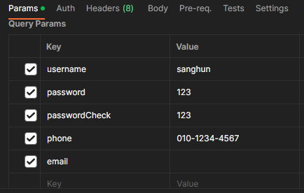

</details>

<details>
<summary>🟨 <b>로그인</b> : POST /users/login </summary>

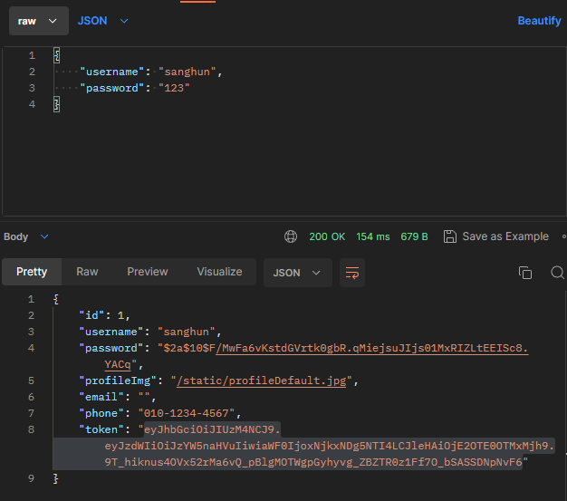

</details>


<details>
<summary> 🟩 <b>유저 조회</b> : GET /users/{id} </summary>

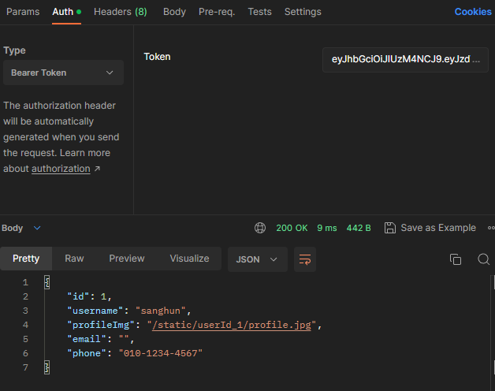

</details>

<details>
<summary>🟨 <b>프로필 이미지 등록</b> : POST /users/profileImg</summary>

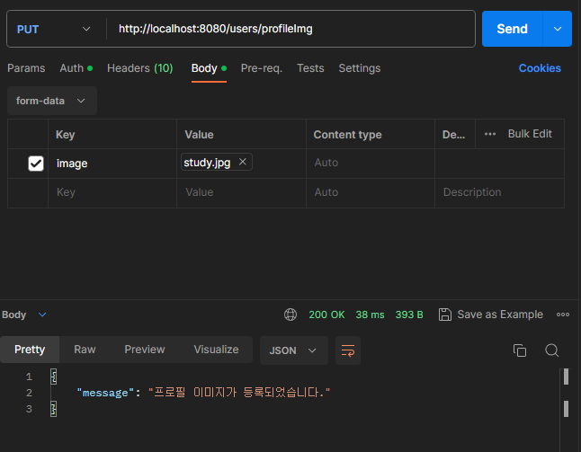

</details>
</details>

<br>

<details>
<summary> <b>📂 ArticleController </b> </summary>
<details>
<summary>🟨 <b>피드 생성</b> : POST /article </summary>


</details>

<details>
<summary>🟨 <b>이미지 업로드</b> : POST /article/{ArticleId}</summary>

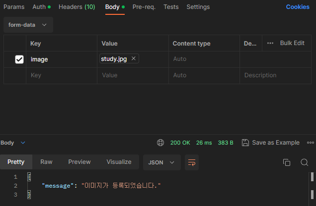

</details>

<details>
<summary>🟩 <b>피드 조회(전체)</b> : GET /article/list</summary>

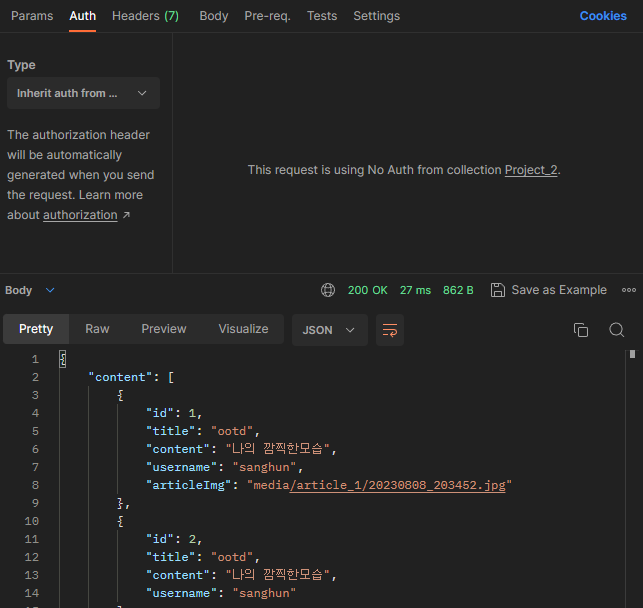

</details>

<details>
<summary>🟩 <b>피드 조회(단독)</b> : GET /article/{articleId}</summary>

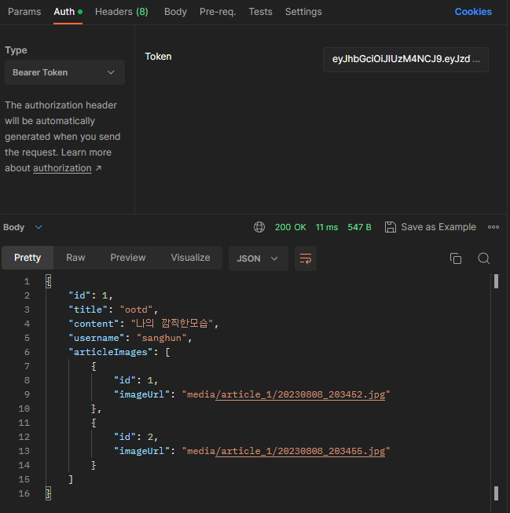

</details>
<details>
<summary>🟦 <b>피드 수정</b> : PUT /article/{articleId}</summary>

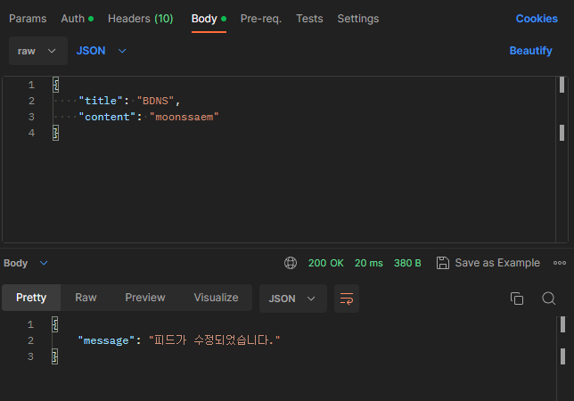

</details>
<details>
<summary>🟦 <b>피드 이미지 추가/삭제(단독)</b> : PUT /article/{articleId}/image</summary>

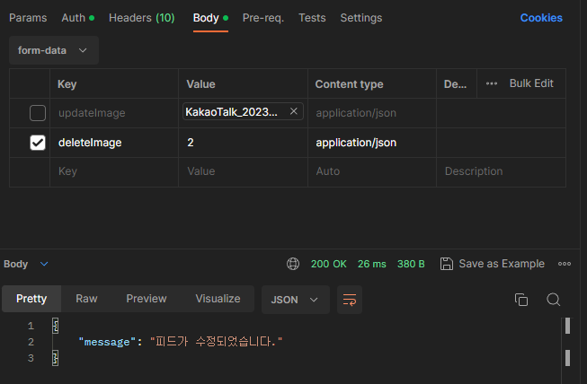

</details>
<details>
<summary>🟥 <b>피드 삭제</b> : DELETE /article/{articleId}</summary>

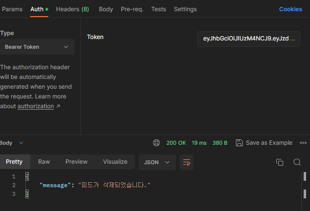

</details>
</details>

<br>

<details>
<summary> <b>📂 CommentController </b> </summary>
<details>
<summary>🟨 <b>댓글 생성</b> : POST /article/{articleId}/comment </summary>

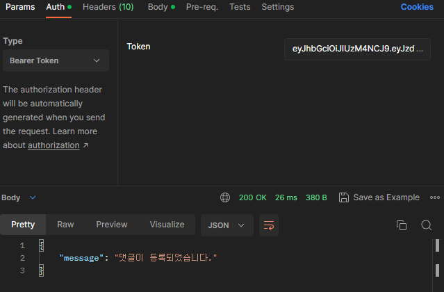

</details>
<details>
<summary>🟥 <b>댓글 삭제</b> : DELETE /article/{articleId}/comment/{commentId} </summary>

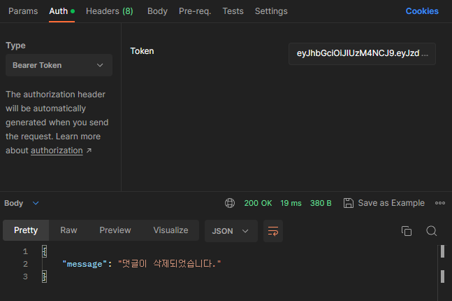

</details>
</details>

<br>

<details>
<summary> <b>📂 HeartController </b> </summary>
<details>
<summary>🟨 <b>좋아요</b> : POST /article/{articleId}/heart </summary>

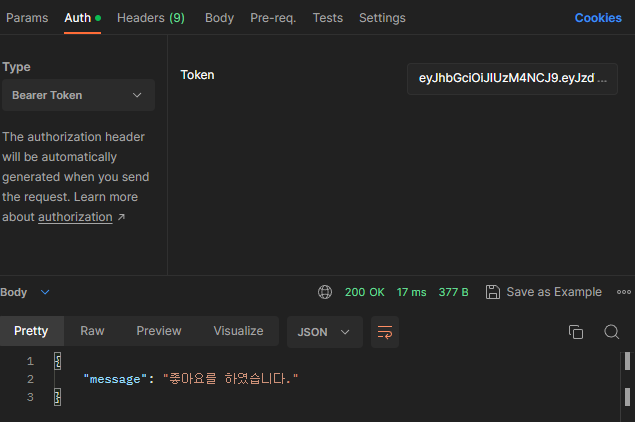

</details>
</details>

<br>

<details>
<summary> <b>📂 HeartController </b> </summary>
<details>
<summary>🟨 <b>팔로우</b> : POST /users/follow/{id} </summary>

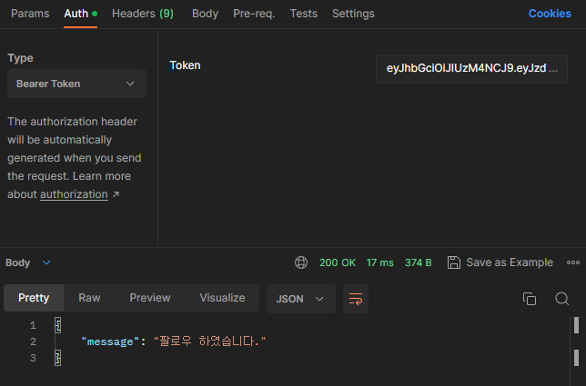

</details>
<details>
<summary>🟨 <b>언팔로우</b> : POST /users/unfollow/{id} </summary>

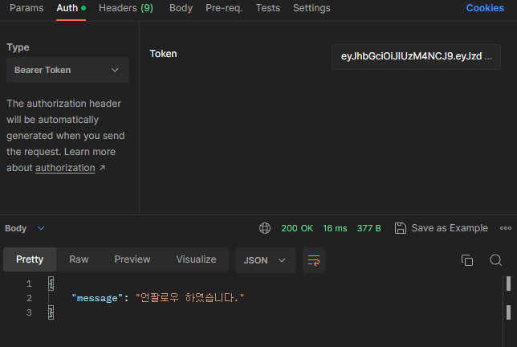

</details>
<details>
<summary>🟩 <b>팔로우 피드 조회</b> : GET /users/follow </summary>

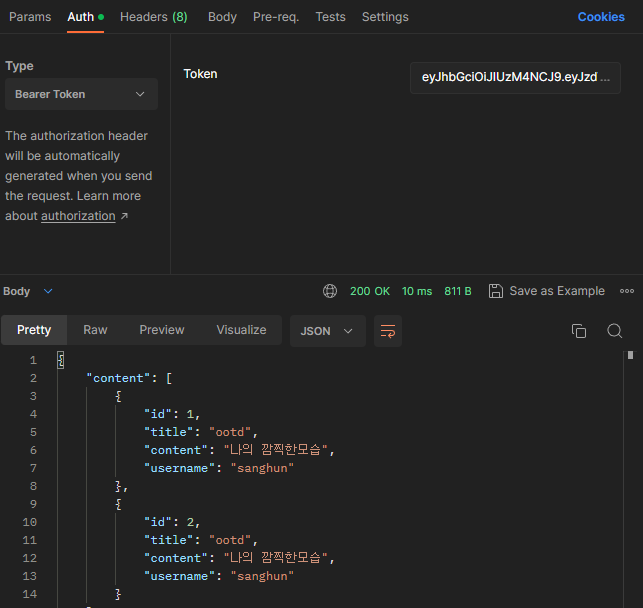

</details>
</details>


## ⚙ 기술 스택
<p>


</p>
<p>


</p>


<br>

 ## ✅ Info
  ### 이광훈 ☺️
  #### hun053@naver.com
  #### https://github.com/hunirin

